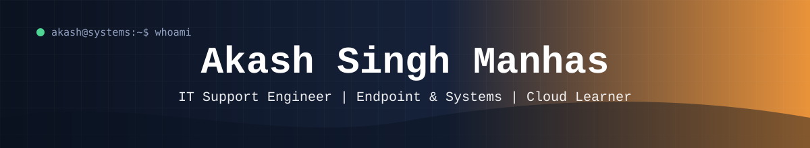

  

  

  

  

---

## 👨‍💻 About Me

<table>
<tr>
<td width="33%" align="center"><h3>🛠️ 1.5+ Years</h3>Desktop and endpoint support AD · SCCM/MECM · Endpoint Central · Zscaler</td>
<td width="33%" align="center"><h3>☁️ Lab-Trained</h3>Jetking AWS · Azure · RHEL · Windows Server · CCNA</td>
<td width="33%" align="center"><h3>🎯 Aiming For</h3>Cloud support Junior sysadmin · DevOps</td>
</tr>
</table>

---

## 🎯 Skills

### 🛡️ Endpoint and Security

### 🎫 ITSM and Support

### ☁️ Cloud and Systems
-232F3E?style=for-the-badge&logo=amazonwebservices&logoColor=white)
-0078D4?style=for-the-badge&logo=microsoftazure&logoColor=white)

### 🌐 Networking

### 💻 Scripting and Tools

---

## 🧪 Labs

<table>
<tr>
<td width="33%" valign="top">
<h3>☁️ LAB_01 AWS EC2 Deployment</h3>
EC2 instance with Apache, a hosted HTML page and security groups.  

</td>
<td width="33%" valign="top">
<h3>🐧 LAB_02 RHEL User Management</h3>
Users, groups, file permissions and Bash scripting.  

</td>
<td width="33%" valign="top">
<h3>🌐 LAB_03 Cisco Packet Tracer</h3>
Small office network with routers, switches, IP addressing and VLANs.  

</td>
</tr>
</table>

---

## 📊 GitHub Stats

  
  

